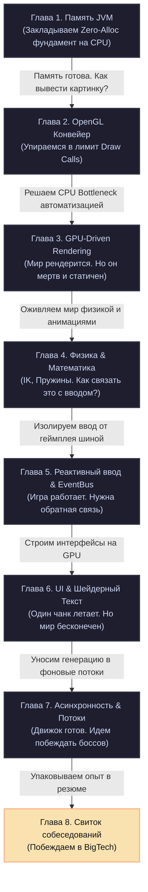

# Zenith Academy: Низкоуровневая разработка «для чайников»

Привет, коллега! Рад приветствовать тебя на старте самого необычного и увлекательного путешествия в твоей карьере. 

Если ты открыл эту книгу, значит, тебе надоело писать скучные стандартные веб-формы, гонять JSON-ы туда-сюда или настраивать очередную базу данных. Тебе хочется прикоснуться к **настоящей магии** — создавать миры, заставлять видеокарту плавиться от миллионов треугольников и понимать, как процессор шевелит каждым битом информации в оперативной памяти.

Добро пожаловать в **Zenith Academy**!

---

## Кто мы и что мы тут делаем?

Большинство программистов ездят на общественном транспорте. Они используют готовые фреймворки, тяжелые движки (Unity, Unreal) и не задумываются, что происходит внутри. Это нормально и безопасно.

Но мы с тобой — **автомеханики гоночных болидов**. Мы собираем собственный высокопроизводительный воксельный движок **Zenith** своими руками прямо в гараже. Мы перебираем двигатель (JVM) до последнего винтика, настраиваем впрыск топлива (VRAM) и выжимаем 144 FPS без единого микрофриза!

Этот учебник написан на примере реального кода Zenith — воксельной RPG. Но главное — он написан в стиле **Mathprofi**. Никакой сухой научной нудятины, сложных формул без объяснений и скучных академических лекций. Всё разжёвано до состояния каши, весело, с юмором и живыми примерами из реальной жизни.

Изучив эти материалы, ты не только разберёшься, как устроен наш движок, но и сможешь с полпинка проходить самые сложные технические собеседования уровня **Middle+ / Senior Java & Graphics Engineer**, легко ставя интервьюеров в тупик своими глубокими знаниями «железа».

---

## Карта нашего гоночного трека (Главы курса)

Наш учебник разбит на 8 специализированных глав. Давай посмотрим, какие крутые темы и весёлые метафоры нас ждут впереди:

### 📦 [Глава 1. Управление памятью JVM & Стратегия Zero-Allocation](chapter_1_jvm_and_memory.md)
* **Простыми словами:** Разбираемся, как устроена память под капотом Java.
* **Живая метафора:** Стопка тарелок на кухне (**Стек**) против детской комнаты, заваленной раскиданными игрушками (**Куча**). Почему строгая мама (**Сборщик Мусора**) кричит *«Stop the World!»* и останавливает нашу игру.
* **Чему научимся:** Писать код с нулевым выделением памяти, упаковывать 3D-координаты в примитивные числа `long` битовыми сдвигами и дружить с кэшем процессора.

### 🖥️ [Глава 2. Графический конвейер OpenGL & Системные вызовы](chapter_2_opengl_pipeline.md)
* **Простыми словами:** Как подружить наш центральный процессор (CPU) с видеокартой (GPU) и заставить их работать на пределе возможностей.
* **Живая метафора:** Видеокарта как огромный автоматический завод. Процессор — ленивый директор, который делает медленные телефонные звонки (**Draw Calls**). Как отправить на завод огромную фуру с кирпичами (**VBO**), таможенную накладную (**VAO**) и запустить роботов-маляров (**шейдеры**).
* **Чему научимся:** Низкоуровневой работе с графикой в LWJGL 3, устранению бутылочного горлышка системных вызовов и созданию шейдеров.

### 🚀 [Глава 3. GPU-Driven Rendering & Оптимизация VRAM](chapter_3_gpu_driven_rendering.md)
* **Простыми словами:** Полная автоматизация рендеринга. Убираем CPU из цепочки отрисовки и отдаем всю власть видеокарте.
* **Живая метафора:** Директор больше не звонит рабочим на завод лично. Он один раз пишет толстую книгу с планом работ (**Indirect Buffer**), и завод собирает миллионы объектов за раз (**MultiDraw Indirect**).
* **Чему научимся:** Архитектуре Mesh Pooling на общем гигантском «складе» VRAM, алгоритмам Connected Textures и умному расчету гладкого света без мигания граней.

### 📐 [Глава 4. Процедурная физика, Линейная алгебра & IK](chapter_4_procedural_physics_and_math.md)
* **Простыми словами:** Математика без страха и слёз. Векторы, матрицы и скелетная анимация на пальцах.
* **Живая метафора:** Симуляция пружины как *«грузик на резинке в банке с густым мёдом»*. Вращение костей рук кватернионами как «умными сферическими шарнирами». Сборка скелета персонажа методом бусин на веревочке (**FABRIK IK**).
* **Чему научимся:** Уравнениям пружины-массы-демпфера, плавной интерполяции Lerp/Slerp, автоориентации текстур через PCA и инверсной кинематике рук/ног персонажа.

### ⚡ [Глава 5. Реактивная шина событий & Архитектура ввода](chapter_5_event_driven_architecture.md)
* **Простыми словами:** Как избавить код от кучи запутанных связей (спагетти-кода) и сделать архитектуру независимой и расширяемой.
* **Живая метафора:** Городская доска объявлений (**EventBus**). Персонаж вешает записку: *«Я нанёс удар!»*, а контроллеры видят её и рассчитывают урон. Никто ни с кем не общается напрямую!
* **Чему научимся:** Созданию Zero-Alloc шины событий, обработке нажатий клавиш на плоских битовых масках и процедурным слабым точкам (Weak Spots) при добыче блоков.

### 🎨 [Глава 6. Рендеринг интерфейсов & Шейдерная анимация шрифтов](chapter_6_ui_and_font_rendering.md)
* **Простыми словами:** Как рисовать красивые меню, окна и заставить буквы на экране эффектно двигаться.
* **Живая метафора:** Обрезка прокручиваемых списков (**glScissor**) как трафаретная картонная маска. Использование школьных синусов и косинусов для анимации букв.
* **Чему научимся:** Рисованию адаптивных UI интерфейсов на JSON, решению проблемы с переворотом систем координат OpenGL и шейдерным эффектам текста (Rainbow, Glow, Wave, Shake).

### 🧵 [Глава 7. Асинхронные вычисления & Многопоточность](chapter_7_concurrency_and_threading.md)
* **Простыми словами:** Запрягаем все ядра процессора работать вместе и следим, чтобы они не поубивали друг друга.
* **Живая метафора:** Потоки как бригада строителей. **Состояние гонки (Data Race)** как два строителя, одновременно пытающиеся писать в один и тот же блокнот. 
* **Чему научимся:** Асинхронной генерации чанков по спирали в фоне, потокобезопасному расчету освещения в `LightEngine` и защите палитры чанка от повреждений с помощью Lock-Free трюков.

### 🏆 [Глава 8. Шпаргалка для IT-собеседований (Senior Cheat Sheet)](chapter_8_interview_cheat_sheet.md)
* **Простыми словами:** Твой секретный боевой свиток для победы над самыми суровыми техническими интервьюерами.
* **Чему научимся:** Как правильно описать проект Zenith в резюме, чтобы удивить рекрутеров, и как отвечать на 20 каверзных вопросов с собеседований на базе нашего кода «без заумной воды, но с глубоким пониманием железа».

---

## 🏎️ Логика нашего маршрута (The Grand Design)

Наш курс — это не случайный набор статей. Это единый, математически выверенный инженерный маршрут, где каждая следующая глава логически вытекает из предыдущей, решая её проблемы:

1. **Глава 1 (Память)**: Если мы не научим JVM не мусорить в память (Zero-Allocation), то любые графические конвейеры в последующих главах будут заикаться из-за GC-пауз. Сначала настраиваем "мозг" и память на CPU.
2. **Глава 2 (OpenGL)**: Память готова. Мы хотим вывести картинку. Мы переносим данные на GPU и учим его рисовать. Но классический подход заставляет процессор делать тысячи звонков (Draw Calls), упираясь в PCIe шину (CPU Bottleneck).
3. **Глава 3 (GPU-Driven)**: Мы решаем проблему Draw Calls, отдав управление самой видеокарте через Mesh Pooling и MultiDraw Indirect. Картинка летает со скоростью 300 FPS! Но мир мертв — блоки стоят неподвижно, рук и анимаций нет.
4. **Глава 4 (Физика и Математика)**: Оживляем персонажа! Внедряем пружинную физику для рук, кватернионы для суставов костей, PCA для правильного хвата предметов и инверсную кинематику FABRIK. Но как связать клики игрока с этой физикой, не превратив код в кашу?
5. **Глава 5 (Event-Driven)**: Мы изолируем обработку ввода от геймплейных механик с помощью шины событий EventBus и битовых масок. Теперь клики вешают записочки на доску, а физика и мир реагируют на них.
6. **Глава 6 (UI и Текст)**: Персонаж ломает блоки, собирает лут и бегает по миру. Но ему нужен интерфейс (HUD, инвентарь, Дневник Выжившего). Мы строим быстрый UI на базе `glScissor` и анимируем текст математическими синусами в шейдере.
7. **Глава 7 (Многопоточность)**: Игра полностью работает в пределах одного чанка. Но стоит игроку побежать по бескрайнему миру, как генерация новых блоков и BFS-свет вешают игру. Мы распараллеливаем вычисления на бригаду строителей (асинхронные потоки), защищая данные Lock-Free трюками.
8. **Глава 8 (Собеседования)**: Наш гоночный болид готов! Мы собираем все низкоуровневые трюки в мощнейшее резюме и учимся отвечать на сложнейшие вопросы BigTech-собеседований.

---

## Как эффективно учиться в Zenith Academy?

1. **Используй интерактивный портал:** Читай главы прямо в веб-интерфейсе, проходи встроенные интерактивные квизы-тесты в конце каждой главы — они помогут закрепить понимание и выявить слабые места.
2. **Экспериментируй в Лаборатории:** Переключайся на вкладку **«Лаборатория»** в боковом меню! Там тебя ждут интерактивные песочницы: дергай за пружину в Spring Simulator, упаковывай вершины в Vertex Compressor и крути настройки шейдеров текста. Пощупать формулы руками — лучший способ их понять!
3. **Открывай код в IDE:** Не верь мне на слово. Открывай реальные классы Zenith в своей IDE, ставь точки останова (breakpoints) в методах рендеринга и физики и смотри, как данные текут по системе.
4. **Проговаривай ответы вслух:** Разделы собеседований в конце глав — это бесценный тренажер. Попробуй объяснить ответ своему коту или резиновой уточке простыми словами. Получилось? Значит, материал усвоен намертво!

Ну что, гонщик, мотор прогрет, трасса свободна. Переключайся на **[Главу 1](chapter_1_jvm_and_memory.md)** в сайдбаре и давай начнем нашу низкоуровневую магию!
