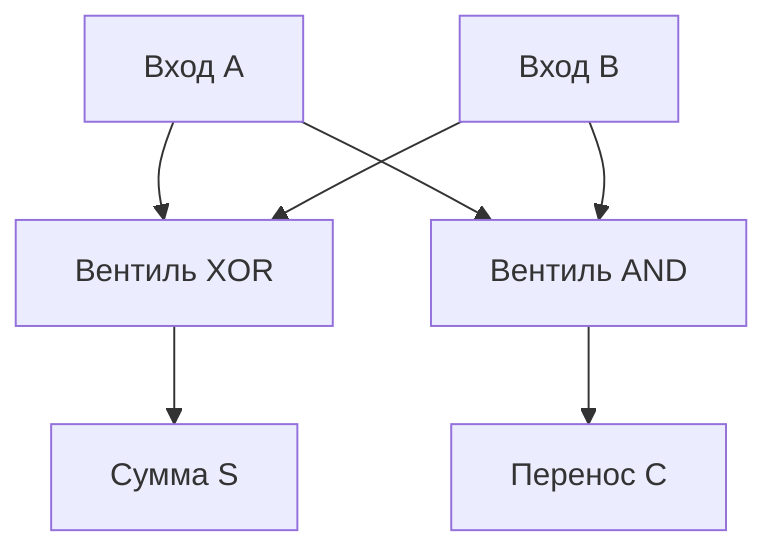

# Глава 0. От кремния к транзистору: Как рождается цифровая логика

Наш путь на самый низкий уровень вычислительных систем начинается не со строк кода на ассемблере, не с компиляторов и даже не с двоичных нулей и единиц. Он начинается с фундаментальных законов электродинамики и квантовой физики твердого тела. Компьютер — это не абстрактная математическая концепция, парящая в пустоте. Это упорядоченный физический объект: сложнейшим образом структурированный кристалл кремния, через тончайшие каналы которого мы заставляем бежать миллиарды электрических зарядов. 

В этой вводной главе мы разберем, как обычный очищенный песок (диоксид кремния) превращается в полупроводниковую матрицу, как работают полевые транзисторы на атомарном уровне, почему современный мир построен на комплементарной логике (КМОП) и как из элементарных физических переключателей собираются цифровые вентили, способные складывать числа, хранить данные и принимать логические решения.

---

## 1. Физика полупроводников: Энергетические зоны и легирование

Чтобы понять, как кремний стал сердцем цифровой революции, необходимо спуститься на микроскопический уровень — к кристаллической решетке атомов и энергетическим состояниям электронов.

### Зонная теория проводимости

В изолированном атоме электроны занимают строго определенные энергетические уровни. Однако, когда атомы объединяются в твердое тело (кристалл), их орбитали перекрываются, образуя **энергетические зоны**:
1. **Валентная зона (Valence Band)**: зона, заполненная электронами, которые прочно связаны со своими атомами и обеспечивают химические связи в решетке.
2. **Зона проводимости (Conduction Band)**: зона более высоких энергий. Электроны, попавшие сюда, освобождаются от связи с конкретными атомами и могут свободно перемещаться по кристаллу под действием внешнего электрического поля, создавая электрический ток.
3. **Запрещенная зона (Bandgap)**: энергетический интервал между валентной зоной и зоной проводимости. В этом диапазоне электроны находиться не могут.

```
    [ Зона проводимости (Свободные электроны) ]
   =============================================
                    ▲
                    │ Запрещенная зона (Bandgap) - Энергетический барьер
                    ▼
   =============================================
    [ Валентная зона (Связанные электроны) ]
```

По ширине запрещенной зоны все вещества делятся на три класса:
* **Проводники (металлы)**: Запрещенная зона отсутствует. Валентная зона и зона проводимости перекрываются. Электронам не требуется дополнительная энергия, чтобы начать переносить заряд.
* **Диэлектрики (изоляторы)**: Запрещенная зона очень широкая (более 3-4 эВ). Электроны намертво «заперты» в валентной зоне, и обычное электрическое поле не способно перебросить их через этот барьер.
* **Полупроводники (кремний, германий)**: Запрещенная зона узкая (для кремния — около 1.12 эВ при комнатной температуре). При абсолютном нуле полупроводник ведет себя как идеальный диэлектрик. Однако при нагревании или воздействии света часть электронов получает достаточно энергии, преодолевает запрещенную зону и переходит в зону проводимости, оставляя в валентной зоне незаполненные места — **«дырки»**.

### Легирование кремния: n-тип и p-тип

Чистый кристаллический кремний (собственный полупроводник) проводит ток слабо. Каждый атом кремния имеет 4 валентных электрона и образует прочные ковалентные связи с четырьмя соседними атомами. Свободных носителей заряда крайне мало.

Чтобы кардинально изменить электрические свойства кремния, применяется технология **легирования** (doping) — контролируемого внедрения примесей других химических элементов в кремниевую решетку.

#### Полупроводник n-типа (Negative / Донорный)
Если заместить небольшую часть атомов кремния атомами элементов V группы периодической таблицы (например, **фосфором** или **мышьяком**), возникнет избыток свободных зарядов. 
У фосфора 5 валентных электронов. Четыре из них образуют связи с кремнием, а пятый оказывается «лишним». Энергия связи этого электрона с ядром фосфора ничтожно мала, и он легко отрывается, переходя в зону проводимости. 
* Примеси, отдающие электроны, называют **донорами**.
* Основными носителями заряда в полупроводнике n-типа являются **отрицательно заряженные электроны**.

#### Полупроводник p-типа (Positive / Акцепторный)
Если внедрить в кремний атомы III группы (например, **бор** или **индий**), возникнет дефицит электронов.
У бора всего 3 валентных электрона. Для завершения связей с четырьмя соседними атомами кремния ему не хватает одного электрона. Бор захватывает электрон из валентной зоны кремния, образуя отрицательный ион, жестко закрепленный в решетке, и оставляя подвижную вакансию — **«дырку»** в валентной зоне. 
* Соседний электрон из валентной зоны может перескочить на эту вакансию, сместив «дырку» в другое место. 
* Дырка ведет себя в точности как **подвижный положительный заряд**.
* Примеси, захватывающие электроны, называют **акцепторами**.
* Основными носителями заряда в p-типе являются **положительные дырки**.

---

## 2. P-N переход: Физический клапан

Величайшая магия начинается тогда, когда мы соединяем полупроводники p-типа и n-типа в едином кристалле. Область их соприкосновения называется **p-n переходом**. Это фундаментальный кирпичик всей микроэлектроники.

### Образование обедненной зоны (Depletion Region)

В момент контакта носители заряда устремляются навстречу друг другу из-за разницы концентраций (диффузия):
1. Свободные электроны из n-области переходят через границу в p-область и рекомбинируют (объединяются) с дырками.
2. Этот процесс не идет до бесконечности. Уходя из n-области, электроны оставляют за собой нескомпенсированные положительные ионы примеси (фосфора). А приходя в p-область, они создают слой отрицательных ионов примеси (бора).
3. На границе раздела образуется двойной слой зарядов противоположного знака, создающий сильное внутреннее электрическое поле.
4. Это поле препятствует дальнейшей диффузии электронов и дырок. Наступает равновесие.
5. Область вблизи границы, лишенная подвижных носителей заряда, называется **обедненной зоной** (или барьером). Она обладает колоссальным электрическим сопротивлением.

```
       p-область (дырки +)          n-область (электроны -)
   ============================  ============================
  |  +    +    - - -    +  +   ||   -    -    + + +    -    -  |
  |  +    +   [ Ионы  ] +  +   ||   -    -   [ Ионы  ] -    -  |
  |  +    +   [ бора- ] +  +   ||   -    -   [ фосф+ ] -    -  |
   ============================  ============================
              ▲                              ▲
              │                              │
              └──────── Обедненная зона ─────┘
                    (Высокое сопротивление)
```

### Прямое и обратное смещение

Если подключить к p-n переходу внешний источник питания, мы получим два принципиально разных режима:

* **Обратное смещение (Ток заблокирован)**:
  Мы подключаем плюс источника к n-области, а минус — к p-области. Внешнее поле совпадает по направлению с внутренним. Оно растаскивает подвижные носители от границы раздела, расширяя обедненную зону. Переход закрывается, ток практически равен нулю.
* **Прямое смещение (Ток течет)**:
  Мы подключаем плюс к p-области, а минус — к n-области. Внешнее поле направлено против внутреннего. Оно сжимает обедненную зону, преодолевая потенциальный барьер. Электроны лавиной устремляются в p-область, а дырки — в n-область. Сопротивление резко падает, через диод течет мощный ток.

Таким образом, простой p-n переход выполняет роль **диода** — одностороннего клапана для электрического тока.

---

## 3. Транзистор MOSFET: Управляемый электронный ключ

Сам по себе диод полезен, но он не умеет усиливать сигналы или выполнять логические операции, так как у него нет управляющего электрода. Чтобы создать управляемый ключ, нужен третий электрод. Так рождается полевой транзистор со структурой металл-оксид-полупроводник (**MOSFET** - Metal-Oxide-Semiconductor Field-Effect Transistor).

В современных процессорах используется два типа таких транзисторов: **n-канальные (NMOS)** и **p-канальные (PMOS)**. Рассмотрим устройство **n-канального MOSFET**:

```
                  Затвор (Gate) [Металл/Поликремний]
                        ┌───────────┐
                        │  Z A T V  │
                        └───────────┘
               -------------------------------
              |  Диэлектрик (SiO2 - Оксид)    | <-- Изолятор
  -------------------------------------------------------------
 [ Исток (Source) ] (n+) | Канал (p-тип) | [ Сток (Drain) ] (n+)
  -----------------------|               |---------------------
                         | Подложка (p)  |
                         └───────────────┘
```

### Четыре элемента транзистора:
1. **Исток (Source)**: Область с высокой концентрацией электронов (n-тип), отсюда носители начинают свое движение.
2. **Сток (Drain)**: Область n-типа, куда электроны уходят.
3. **Затвор (Gate)**: Управляющий электрод. Он расположен прямо над областью канала, но физически отделен от него тончайшим диэлектрическим слоем оксида кремния ($SiO_2$). Ток через затвор не течет — управление происходит исключительно за счет **электрического поля**.
4. **Подложка (Substrate / Канал)**: Область p-типа, разделяющая исток и сток.

### Физика работы:
* **Закрытое состояние (Логический `0`)**:
  Напряжение на затворе равно нулю ($V_g = 0$). Между истоком и стоком находятся встречно включенные p-n переходы подложки. Электроны не могут перетечь из истока в сток через p-область. Ключ закрыт, сопротивление цепи стремится к бесконечности.
* **Открытие канала (Логическая `1`)**:
  Мы подаем на затвор положительное напряжение ($V_g > V_{threshold}$). Электрическое поле затвора проникает сквозь тонкий слой диэлектрика вглубь подложки. Оно начинает выталкивать положительные дырки из приповерхностного слоя вниз, вглубь подложки, и притягивать свободные электроны из областей истока и стока к поверхности раздела.
  Когда напряжение превышает пороговое, у поверхности накапливается критическая масса электронов. Происходит физическое явление — **инверсия типа проводимости**. Узкая полоска p-подложки прямо под затвором временно «перерождается» в проводящий слой n-типа. Образуется непрерывный проводящий **n-канал**, соединяющий исток и сток. Транзистор открывается, через него начинает течь ток.

В **PMOS** транзисторах всё устроено с точностью до наоборот: исток и сток сделаны из p-материала, канал — из n-материала, а для открытия транзистора на затвор нужно подать отрицательное напряжение (или логический `0`).

> [!NOTE]
> Электроны обладают значительно большей подвижностью (примерно в 2.5-3 раза), чем дырки. Поэтому n-канальные транзисторы (NMOS) переключаются быстрее и обладают меньшим сопротивлением в открытом состоянии, чем p-канальные (PMOS). Именно поэтому в реальной схемотехнике PMOS-транзисторы делают физически шире, чтобы сбалансировать времена их переключения.

---

## 4. КМОП-технология (CMOS): Архитектура нулевого потребления

В ранних компьютерах использовались логические схемы на базе только NMOS-транзисторов с резистивной подтяжкой к питанию. У них был фатальный недостаток: когда транзистор был открыт, ток непрерывно тек от источника питания на землю. Процессоры выделяли колоссальное количество тепла даже в простое.

Решением стала технология **КМОП** (Комплементарный Металл-Оксид-Полупроводник, или **CMOS**). Её суть заключается в том, что логические элементы строятся парами: один NMOS и один PMOS транзистор управляются синхронно.

Рассмотрим простейший базовый элемент — **инвертор (NOT Gate)**:

```
                  +Vcc (Питание, 1)
                      │
                    ┌─┴─┐
              ┌────┤ P ├ (PMOS - открывается логическим 0)
              │     └─┬─┘
  Вход (In) ──┤       ├─── Выход (Out)
              │     ┌─┴─┐
              └────┤ N ├ (NMOS - открывается логической 1)
                    └─┬─┘
                      │
                     GND (Земля, 0)
```

### Логика работы КМОП-инвертора:
1. **На входе логический `0` (низкое напряжение)**:
   * NMOS закрыт (ему нужно положительное напряжение для открытия канала).
   * PMOS открыт (он открывается низким потенциалом на затворе).
   * Выход оказывается соединен с шиной питания $+V_{cc}$ через открытый PMOS. На выходе формируется чистая логическая **`1`**.
2. **На входе логическая `1` (высокое напряжение)**:
   * PMOS закрывается.
   * NMOS открывается и соединяет выход напрямую с землей (GND). На выходе формируется логический **`0`**.

### Почему КМОП — это гениально?
Обрати внимание: в любом установившемся статическом состоянии (когда на входе стабильный `0` или стабильная `1`) один из двух последовательно включенных транзисторов **гарантированно закрыт**. 
Путь току от питания к земле заблокирован. Статическое потребление энергии идеальной КМОП-схемы равно **нулю** (в реальности присутствуют лишь ничтожные токи утечки через ультратонкие диэлектрики затворов).

Энергия потребляется только в короткие моменты **переключения** состояний. Когда напряжение на входе меняется с 0 на 1 или наоборот, на доли наносекунды приоткрыты оба транзистора, а также тратится энергия на зарядку/разрядку паразитных емкостей затворов последующих логических схем.

> [!TIP]
> Именно поэтому тепловыделение процессора растет линейно с ростом его тактовой частоты ($P \approx C \cdot V^2 \cdot f$). Чем чаще переключаются транзисторы в секунду, тем больше энергии они потребляют и тем сильнее греется кристалл.

---

## 5. Создание логических вентилей из транзисторов

Соединяя КМОП-пары различным образом, мы можем конструировать любые логические вентили. В цифровой электронике базовыми кирпичиками являются вентили **NAND (И-НЕ)** и **NOR (ИЛИ-НЕ)**.

### Вентиль NAND (И-НЕ)

Давай посмотрим, как устроен КМОП-вентиль NAND, принимающий два входа ($A$ и $B$):

```
                   +Vcc (Питание)
                 ┌────┴────┐
                 │         │
               ┌─┴─┐     ┌─┴─┐
         A ───┤ P1├     ┤ P2├──── B  (Два PMOS параллельно)
               └─┬─┘     └─┬─┘
                 └────┬────┘
                      ├─── Выход (Y = NOT (A AND B))
                    ┌─┴─┐
         A ───┤ N1├ (NMOS 1)
                    └─┬─┘
                    ┌─┴─┐
         B ───┤ N2├ (NMOS 2)  (Два NMOS последовательно)
                    └─┬─┘
                      │
                     GND
```

* **Если на входах $A$ или $B$ (или на обоих) есть `0`**:
  Хотя бы один из параллельных PMOS-транзисторов ($P_1, P_2$) будет открыт, соединяя выход с питанием. При этом последовательная цепочка NMOS ($N_1, N_2$) разорвана. На выходе **`1`**.
* **Если на обоих входах $A$ и $B$ подана `1`**:
  Оба PMOS-транзистора закрыты. Зато оба NMOS-транзистора открыты, образуя непрерывный путь от выхода к земле. На выходе **`0`**.

Это в точности соответствует таблице истинности операции **И-НЕ**:

| Вход A | Вход B | Выход Y (NAND) |
| :---: | :---: | :---: |
| 0 | 0 | 1 |
| 0 | 1 | 1 |
| 1 | 0 | 1 |
| 1 | 1 | 0 |

> [!IMPORTANT]
> **Универсальный логический базис (Штрих Шеффера)**:
> Вентили NAND и NOR являются функционально полными. Это означает, что используя исключительно вентили NAND (или только NOR), можно собрать абсолютно любую логическую функцию произвольной сложности (включая AND, OR, NOT, XOR, сумматоры и триггеры памяти). В реальном кремнии процессоров большинство схем собирается именно из вентилей NAND/NOR, так как они физически проще и компактнее в производстве.

---

## 6. От вентилей к вычислениям: Архитектура сумматора

Теперь, когда у нас есть логические вентили, мы можем подняться на уровень абстракции выше и собрать из них математическое устройство. Начнем со сложения двоичных чисел.

### Полусумматор (Half Adder)

Полусумматор складывает два однобитных числа ($A$ и $B$) и выдает два результата: сумму ($S$) и бит переноса в старший разряд ($C$ - Carry).

Логика сложения:
* $0 + 0 = 0$ (Сумма $S = 0$, Перенос $C = 0$)
* $0 + 1 = 1$ (Сумма $S = 1$, Перенос $C = 0$)
* $1 + 0 = 1$ (Сумма $S = 1$, Перенос $C = 0$)
* $1 + 1 = 10_2$ (Сумма $S = 0$, Перенос $C = 1$)

Для расчета суммы $S$ нам идеально подходит операция **XOR (Исключающее ИЛИ)**, а для расчета переноса $C$ — операция **AND (И)**.



### Полный сумматор (Full Adder)

Полусумматор не умеет учитывать перенос, пришедший из предыдущего (младшего) разряда при сложении многобитных чисел. Для этого используется **Полный сумматор**, принимающий три входа: $A$, $B$ и $C_{in}$ (входящий перенос).

Схема полного сумматора строится из двух полусумматоров и одного вентиля OR:

```
            ┌───────────────┐
   A ───────┤               │
            │  Полусумматор ├─── (S1) ───┐   ┌───────────────┐
   B ───────┤       1       │            └───┤               │
            │               ├─── (C1) ──┐    │  Полусумматор ├────── Выход Sum (S)
            └───────────────┘           │    │       2       │
                                        │    │               │
  Cin ──────────────────────────────────┼────┤               │
                                        │    │               ├──(C2)──┐
                                        │    └───────────────┘        │   ┌──────┐
                                        │                             └───┤  OR  ├─ Выход Cout
                                        └─────────────────────────────────┤      │
                                                                          └──────┘
```

Соединив 64 таких полных сумматора последовательно (выход $C_{out}$ предыдущего соединяется со входом $C_{in}$ последующего), мы получим **пульсирующий сумматор** (Ripple Carry Adder), способный за один проход сложить два 64-битных числа!

Правда, в реальных процессорах последовательный перенос работает слишком медленно, так как электрический сигнал должен последовательно пройти через все 64 инстанса сумматора. Для ускорения инженеры используют сложные схемы **ускоренного переноса** (Carry Lookahead Adders), которые рассчитывают перенос параллельно для всех разрядов с помощью многоуровневой логики.

---

## 7. Бесшовный мост: От вентилей к координатору

Мы совершили колоссальный путь: от кристаллической решетки кремния и квантового движения электронов сквозь p-n переходы до логических вентилей КМОП и цепочек сумматоров, способных выполнять сложение. 

Но представь себе процессор, состоящий из миллиардов таких вентилей. Вентили сумматора умеют только складывать. Вентили мультиплексора — только перенаправлять потоки. Если они будут работать хаотично и неуправляемо, компьютер превратится в генератор теплового шума. 

Для осмысленных вычислений нам нужен строгий порядок. Нам нужно устройство, которое умеет:
1. Хранить цепочки команд (программу) в памяти.
2. Поочередно извлекать эти команды.
3. Декодировать их (понимать: "ага, сейчас нужно сложить регистр A с регистром B, а результат отправить в память").
4. Подавать управляющие электрические сигналы на соответствующие логические блоки в строго определенные моменты времени.

Вся эта гигантская армия транзисторов нуждается в едином, беспощадном и сверхточном дирижере. И этим дирижером является **Центральный Процессор (CPU)**. В следующей главе мы детально препарируем его архитектуру и разберем, как устроен этот величайший кремниевый завод.
