# Глава 1. Анатомия CPU: Такты, регистры и предсказание будущего

Процессор (CPU) — это «мозг» нашего компьютера. Он считывает байты из оперативной памяти, декодирует их в понятные для кремния инструкции и выполняет их со скоростью миллиардов операций в секунду. 

В этой главе мы разберем архитектуру процессорного ядра и выясним, почему оптимизация кода под внутренние конвейеры процессора — это главный секрет высокой производительности игр.

---

## 1. Регистры и АЛУ: Кремниевое ядро

Внутри каждого ядра процессора есть три ключевых блока:

1. **Регистры (Registers)**: Это сверхбыстрые ячейки памяти, расположенные прямо на арифметических схемах ядра. У процессора x86-64 есть 16 основных 64-битных регистров общего назначения (RAX, RBX, RCX и т.д.). Чтение из регистра занимает **0 тактов** (происходит мгновенно). Вся работа процессора идет строго через них: чтобы сложить два числа, процессор должен сначала загрузить их из RAM в регистры.
2. **АЛУ (Arithmetic Logic Unit / Арифметико-Логическое Устройство)**: Кремниевый калькулятор, состоящий из логических вентилей, который физически выполняет сложение, вычитание, сдвиги и побитовые операции над регистрами.
3. **Управляющее устройство (Control Unit)**: Дирижер, который считывает из памяти адрес следующей команды (из регистра RIP - Instruction Pointer), декодирует её (понимает, что это, например, сложение `ADD`) и подает нужные сигналы АЛУ и регистрам.

---

## 2. Процессорный такт и конвейер

Работа процессора разбита на **такты**. Такт (Clock Cycle) — это единичный импульс генератора частоты. Процессор с частотой 4 ГГц делает 4 миллиарда тактов в секунду. За один такт сигналы успевают пройти один слой транзисторов.

Если бы процессор выполнял каждую команду от начала до конца перед тем как начать следующую, производительность была бы ничтожной. Поэтому используется **Конвейер инструкций (Pipeline)**.

Процесс обработки инструкции делится на стадии:
1. **Fetch (Выборка)**: Считывание инструкции из памяти.
2. **Decode (Декодирование)**: Расшифровка команды.
3. **Execute (Выполнение)**: АЛУ производит вычисления.
4. **Memory Access (Работа с памятью)**: Чтение/запись данных в память (если нужно).
5. **Writeback (Запись)**: Сохранение результата в регистр.

```mermaid
graph TD
    subgraph Инструкция 1
        F1["Fetch (Такт 1)"] --> D1["Decode (Такт 2)"] --> E1["Execute (Такт 3)"] --> M1["Memory (Такт 4)"] --> W1["Writeback (Такт 5)"]
    end
    subgraph Инструкция 2
        F2["Fetch (Такт 2)"] --> D2["Decode (Такт 3)"] --> E2["Execute (Такт 4)"] --> M2["Memory (Такт 5)"] --> W2["Writeback (Такт 6)"]
    end
    subgraph Инструкция 3
        F3["Fetch (Такт 3)"] --> D3["Decode (Такт 4)"] --> E3["Execute (Такт 5)"] --> M3["Memory (Такт 6)"] --> W3["Writeback (Такт 7)"]
    end
```



Благодаря конвейеру, на каждом такте процессор заканчивает выполнение **одной полной инструкции**, параллельно обрабатывая другие инструкции на более ранних стадиях.

---

## 3. Предсказатель переходов (Branch Predictor)

Конвейер работает отлично, пока код идет строго линейно. Но как только в коде появляется ветвление:
```java
if (x > 0) {
    doA();
} else {
    doB();
}
```
Процессор не знает, какую инструкцию загружать в конвейер следующей (пока не выполнится проверка `x > 0` на стадии `Execute`). 

Остановить конвейер и ждать проверки — слишком дорого (это заморозит ядро на 5-10 тактов). Поэтому процессор использует **Предсказатель переходов (Branch Predictor)** — нейросетеподобный блок, который анализирует историю прошлых переходов и *угадывает*, выполнится ли условие:

* Если предсказатель угадал: процессор продолжает работать на полной скорости.
* Если предсказатель ошибся (**Branch Misprediction**): процессор вынужден экстренно остановить работу, полностью очистить конвейер от «неправильных» наполовину готовых инструкций и начать загрузку заново. Это штраф в **15-20 потерянных тактов**!

> [!TIP]
> **Золотое правило оптимизации**: Избегай ветвлений (`if/else`) в критических циклах движка (например, при обработке миллионов вокселей). Пиши безветвленный (branchless) код, используя битовые маски и математику.

---

## 4. Векторные вычисления (SIMD)

Современные процессоры поддерживают инструкции **SIMD** (Single Instruction Multiple Data - «одна инструкция, много данных»). 

Вместо сложения двух обычных чисел float за раз, SIMD позволяет использовать широкие регистры (AVX-512 имеет ширину 512 бит) и складывать, к примеру, 16 чисел float одновременно за одну операцию!

В 3D движках SIMD незаменим при:
* Расчете скелетной анимации (интерполяция кватернионов).
* Расчете физики частиц и столкновений.
* Проекции 3D вершин на экран.

В следующей главе мы спустимся к злейшему врагу производительности процессора — к задержкам оперативной памяти, и разберем, как L1/L2/L3 кэши спасают компьютер от постоянных простоев.
