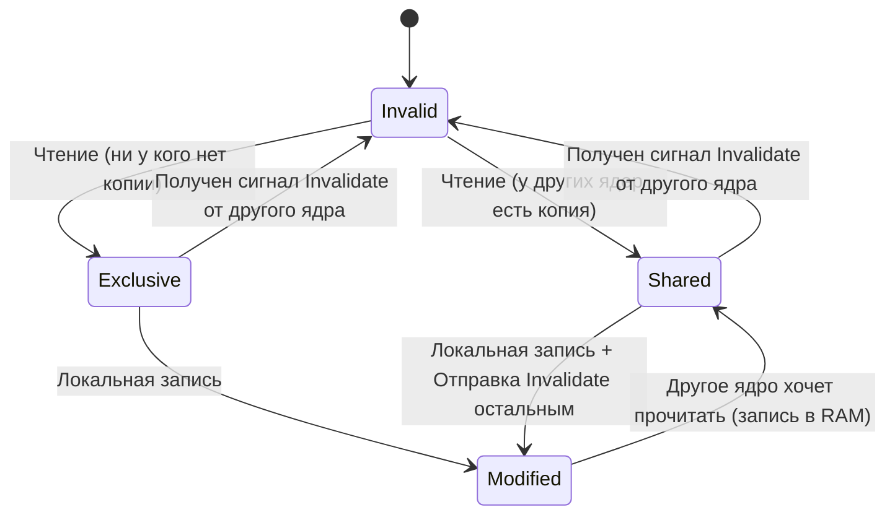

# Глава 2. Иерархия памяти: Кэш-линии, задержки и враги производительности

Процессор невероятно быстр, но он абсолютно бесполезен без памяти. Память хранит инструкции, текстуры, геометрию вокселей, статы персонажей и код логики. 

Главный парадокс компьютерного железа заключается в том, что процессоры за последние 40 лет стали работать быстрее в тысячи раз, а скорость доступа к оперативной памяти (RAM) увеличилась всего на порядок. Возникла колоссальная диспропорция скоростей.

В этой главе мы изучим многоуровневую систему памяти, разберем физические различия между статической и динамической памятью, поймем внутреннее устройство кэш-линий и ассоциативности, детально изучим аппаратные протоколы когерентности в многоядерных чипах и научимся писать код, который работает в симбиозе с кэшем процессора.

---

## 1. Физическое устройство памяти: SRAM против DRAM

В основе иерархии памяти лежат два кардинально разных физических способа хранения бита информации: **статический** и **динамический**.

### SRAM (Static RAM - Статическая память)

Ячейка статической памяти хранит бит с помощью группы транзисторов, объединенных в схему триггера (обычно используется **6-транзисторная ячейка, 6T-SRAM**). 

```
          +Vcc (Питание)
              │
          ┌───┴───┐
          │  INV1 │ ─── (Бит) ───┐
          └───┬───┘              │
              │ <── Обратная ────┤
              │     связь        │
          ┌───┴───┐              │
          │  INV2 │ <────────────┘
          └───┬───┘
              │
             GND
```

* **Принцип работы**: Два инвертора включены встречно-последовательно. Выход первого соединен со входом второго, а выход второго — со входом первого. Возникает стабильная обратная связь. Если на выходе первого инвертора установился `1`, он удерживает на выходе второго `0`, который в свою очередь поддерживает `1` на первом. Это состояние может сохраняться бесконечно долго, пока подается питание.
* **Достоинства**: Сверхвысокая скорость работы (доступ за 1 такт, доли наносекунды). Состояние переключается мгновенно.
* **Недостатки**: Низкая плотность и огромная стоимость. Для хранения одного бита требуется минимум 6 транзисторов. Это занимает очень много драгоценной площади кремниевого кристалла. 
* **Где используется**: Кэш-память процессора (L1, L2, L3).

### DRAM (Dynamic RAM - Динамическая память)

Ячейка динамической памяти устроена предельно просто: она состоит всего из **одного транзистора и одного микроконденсатора (1T1C ячейка)**.

```
  Линия записи (Bitline) ─────────────┐
                                      │
                                    ┌─┴─┐
  Линия выбора (Wordline) ─────────┤ T ├ (Транзистор-ключ)
                                    └─┬─┘
                                      │
                                    ┌─┴─┐
                                    │ C │ (Конденсатор - хранит заряд)
                                    └─┬─┘
                                      │
                                     GND
```

* **Принцип работы**: Бит информации кодируется наличием или отсутствием электрического заряда на микроконденсаторе. Если конденсатор заряжен — это логическая `1`, если разряжен — `0`. Транзистор выступает в роли обычного ключа: когда мы подаем сигнал на линию выбора (Wordline), транзистор открывается, позволяя прочитать или изменить заряд конденсатора через линию записи (Bitline).
* **Достоинства**: Невероятная плотность и дешевизна. На площади одного квадратного миллиметра можно разместить миллиарды ячеек.
* **Недостатки**:
  1. **Медлительность**: Процесс заряда и разряда конденсатора требует физического времени. Кроме того, чтение является разрушающим: при чтении заряд конденсатора сливается в считывающую линию, и контроллер памяти обязан тут же перезаписать данные обратно.
  2. **Утечки заряда и циклы регенерации (Refresh)**: Конденсаторы микроскопичны, и заряд с них постоянно утекает сквозь несовершенный диэлектрик транзистора. Чтобы данные не стерлись, контроллер памяти вынужден каждые несколько миллисекунд (обычно каждые 64 мс) приостанавливать работу и принудительно считывать и перезаписывать каждую строку памяти. Этот процесс называется **регенерацией памяти (DRAM Refresh)**. В моменты регенерации память физически недоступна для процессора, что создает микроскопические задержки.
* **Где используется**: Оперативная память компьютера (планки DDR4/DDR5).

---

## 2. Пирамида Скоростей: Временная шкала повара

Давай сравним задержки доступа к разным уровням памяти. Чтобы прочувствовать пропасть между тактами процессора и миллисекундами реального мира, применим классическую геймдев-аналогию. 

Представь, что **процессор — это шеф-повар** на элитной кухне, который готовит сложное блюдо (выполняет расчет кадра игры):

| Уровень памяти | Физическое расстояние | Время доступа (в тактах) | Реальное время доступа | Масштабированная аналогия (1 такт = 1 секунда) |
| :---: | :---: | :---: | :---: | :--- |
| **Регистры** | Прямо в АЛУ | **0 тактов** | $< 0.25$ нс | Ингредиент уже зажат в руке повара |
| **Кэш L1** | На ядре CPU (32-64 КБ) | **~4 такта** | $\approx 1$ нс | Специя стоит на столе прямо перед поваром (4 сек) |
| **Кэш L2** | На ядре CPU (512 КБ - 1 МБ) | **~12 тактов** | $\approx 3$ нс | Дотянуться до полки над разделочным столом (12 сек) |
| **Кэш L3** | Общий на кристалле (16-96 МБ) | **~40 тактов** | $\approx 10$ нс | Сходить к холодильнику в конце кухни (40 сек) |
| **Системная RAM**| Вне кристалла (планки DDR) | **~200-400 тактов** | $\approx 60-100$ нс | Выйти из ресторана, поймать такси и съездить на склад за город (5-7 минут) |
| **NVMe SSD** | Шина PCIe M.2 | **~10 000+ тактов** | $\approx 10-50$ мкс | Собрать чемодан, купить билет на самолет и полететь на ферму в другую страну (3-5 дней) |

Если наш "шеф-повар" на каждый шаг алгоритма рендеринга чанка Zenith будет делать запрос напрямую в оперативную память (RAM), он будет простаивать 99% времени своего рабочего дня. 

Чтобы не допустить этой катастрофы, процессоры используют **принцип локальности данных**:
1. **Временная локальность (Temporal Locality)**: Если программа обратилась к какому-то адресу памяти, с высокой вероятностью она обратится к нему снова в ближайшем будущем (например, счетчик цикла `i`).
2. **Пространственная локальность (Spatial Locality)**: Если программа обратилась к какому-то адресу, с высокой вероятностью она скоро обратится к соседним адресам (например, итерация по последовательному массиву).

---

## 3. Кэш-линии (Cache Lines): Единица обмена данных

Чтобы реализовать пространственную локальность, процессор никогда не считывает данные из RAM побайтово. Минимальной единицей трансляции данных между RAM и кэшами является **кэш-линия (Cache Line)**. В современных процессорах x86 размер кэш-линии равен строго **64 байтам**.

Когда ты просишь процессор прочитать одну переменную типа `float` (4 байта):
1. Процессор вычисляет, в какую 64-байтную кэш-линию попадает этот адрес памяти.
2. Происходит физическая загрузка всей 64-байтной линии целиком из RAM в L3, затем в L2 и, наконец, в L1d кэш.
3. Программа мгновенно получает свои 4 байта.
4. Но самое важное: остальные 60 байт соседних данных теперь тоже лежат в L1 кэше! Если твоя следующая операция считывает соседний элемент массива, доступ займет не 300 тактов, а всего 4.

```
  Адрес в RAM: [ 0x00 ... 0x03 ] [ 0x04 ... 0x07 ] ... [ 0x3C ... 0x3F ]
              └────────────────────────────────────────────────────────┘
                              Вся кэш-линия (64 байта)
                                          │
                                          ▼
                              Загружается в Кэш L1
```

---

## 4. Организация кэша: Ассоциативность

Как процессор определяет, лежит ли нужный адрес памяти в кэше, и куда именно его поместить? Для этого кэш-память разбивается на наборы. Существует три способа организации кэша:

1. **Прямое отображение (Direct-Mapped Cache)**:
   Каждый адрес памяти жестко привязан строго к одной конкретной строке кэша с помощью простой хэш-функции (например, `кэш_индекс = адрес % число_строк`). 
   * *Плюс*: Сверхбыстрый поиск (нужно проверить только одну ячейку).
   * *Минус*: Огромный риск **конфликтов кэша**. Если программа попеременно обращается к двум переменным, адреса которых хэшируются в один и тот же индекс кэша, они будут постоянно выбивать друг друга. Процессор уйдет в бесконечный цикл холодных промахов (thrashing).
2. **Полностью ассоциативный кэш (Fully Associative Cache)**:
   Любая кэш-линия из RAM может быть сохранена в абсолютно любом месте кэша.
   * *Плюс*: Нулевой риск конфликтов. Кэш заполняется идеально плотно.
   * *Минус*: Невероятно сложная и дорогая аппаратная реализация. Чтобы найти нужный адрес, процессору приходится параллельно опрашивать теги абсолютно всех ячеек кэша, что требует гигантского количества транзисторов и сильно замедляет работу.
3. **Множественно-ассоциативный кэш (Set-Associative Cache)**:
   Золотая середина, используемая во всех современных CPU. Кэш делится на наборы (Sets), а каждый набор содержит фиксированное число строк — **путей ассоциативности** (Ways). Например, в 8-канальном (8-way) ассоциативном кэше каждый адрес из RAM может быть помещен в любую из 8 строк внутри одного конкретного набора.

```
  Адрес памяти разделяется на три части:
   [    Тег (Tag)    ] [  Индекс набора (Index)  ] [ Смещение в линии (Offset) ]
  ───────────────────── ────────────────────────── ─────────────────────────────
         Идентифицирует     Выбирает конкретный     Выбирает нужный байт
         уникальный блок    набор строк кэша        внутри 64-байтной линии
```

Поиск адреса в Set-Associative кэше происходит за два шага:
1. Процессор использует биты *Индекса* адреса, чтобы мгновенно выбрать один конкретный набор строк КМОП.
2. Процессор параллельно сравнивает биты *Тега* запрашиваемого адреса с тегами всех 8 строк в выбранном наборе. Если тег совпал — это **Cache Hit** (попадание)! Если нет — **Cache Miss** (промах).

---

## 5. Когерентность кэшей и протокол MESI

В современных многоядерных процессорах у каждого ядра есть свои локальные кэши L1 и L2, в то время как кэш L3 и оперативная память RAM являются общими. 

Что произойдет, если Ядро 1 и Ядро 2 одновременно прочитали одну и ту же переменную `X` из RAM, а затем Ядро 1 изменило её значение в своем L1 кэше? Если не принять мер, Ядро 2 продолжит работать со старым (устаревшим) значением `X`, что приведет к мгновенному падению операционной системы или порче игровых данных.

Для поддержания целостности данных используется аппаратный протокол **когерентности кэшей MESI**. Каждая кэш-линия в L1/L2 кэшах всегда находится в одном из четырех состояний:

* **M (Modified - Изменена)**:
  Кэш-линия присутствует только в кэше текущего ядра, и её данные изменены по сравнению с общей оперативной памятью RAM. Данное ядро обязано записать её обратно в RAM/L3 перед тем, как линию вытеснит другой поток.
* **E (Exclusive - Монопольная)**:
  Кэш-линия присутствует только в кэше текущего ядра, но её данные полностью совпадают с RAM/L3. Ядро может в любой момент перезаписать её без уведомления остальных ядер.
* **S (Shared - Разделяемая)**:
  Кэш-линия присутствует в кэшах нескольких ядер одновременно и полностью совпадает с RAM/L3. Ядра могут свободно читать её. Но если одно из ядер захочет выполнить запись, оно обязано сначала отправить по внутренней межъядерной шине сигнал инвалидации (Invalidate) всем остальным ядрам.
* **I (Invalid - Недействительная)**:
  Линия пуста или её содержимое устарело. Любая попытка чтения приведет к аппаратному кэш-промаху и потребует повторного запроса данных по шине.



---

## 6. Враг многопоточности: Ложное разделение (False Sharing)

Аппаратная логика протокола MESI порождает одну из самых коварных ловушек для создателей многопоточных игровых движков — **False Sharing (Ложное разделение)**.

Представь структуру данных, управляющую потоками генерации чанков в нашей игре:
```java
class ThreadWorkerState {
    public volatile long tasksProcessed; // Обрабатывается Потоком 1 на Ядре 1
    public volatile long lastActiveTime;   // Обрабатывается Потоком 2 на Ядре 2
}
```

Логически эти две переменные абсолютно независимы. Каждый поток работает со своей переменной. Но физически они объявлены в одном классе и лежат в куче вплотную друг к другу. Размер типа `long` — 8 байт. Две переменные вместе занимают 16 байт, что с легкостью умещается в одну **64-байтную кэш-линию**.

Что происходит на аппаратном уровне:
1. Ядро 1 загружает кэш-линию с обоими полями в состоянии **Shared (S)**.
2. Ядро 2 загружает ту же самую кэш-линию в состоянии **Shared (S)**.
3. Поток 1 инкрементирует `tasksProcessed`. Ядро 1 переводит кэш-линию в состояние **Modified (M)** и отправляет сигнал инвалидации Ядру 2.
4. Кэш-линия на Ядре 2 мгновенно переходит в состояние **Invalid (I)**.
5. Через долю наносекунды Поток 2 пытается обновить `lastActiveTime`. Видя статус **Invalid**, Ядро 2 блокируется, делает долгий запрос к L3 кэшу/RAM, загружает измененную кэш-линию обратно, переводит её в статус **Modified** и отправляет сигнал инвалидации Ядру 1!
6. Процесс повторяется бесконечно.

Ядра процессора вступают в свирепую «пинг-понг» дуэль за одну кэш-линию, хотя логически потоки вообще не пересекаются по данным! Производительность многопоточного кода падает в десятки раз.

> [!TIP]
> **Решение в Java**:
> Для предотвращения False Sharing критически важные, часто изменяемые переменные в многопоточных классах необходимо разносить по разным кэш-линиям. Начиная с Java 8, для этого можно использовать аннотацию `@Contended` (требует флага JVM `-XX:-RestrictContended`), которая принудительно вставляет пустые 64-байтные байтовые поля (отступы, padding) до и после переменной в оперативной памяти.

---

## 7. Виртуальная память, MMU и TLB

Современные операционные системы предоставляют каждой запущенной программе полную иллюзию того, что она является единоличным владельцем всей системной оперативной памяти. Этот механизм называется **Виртуальной Памятью**.

Когда твой код на Java выделяет память под массив вокселей, JVM возвращает виртуальный адрес (например, `0x7FFF12D4C000`). Но физически данные могут лежать в абсолютно другом месте реальной RAM, а часть страниц вообще может быть выгружена на системный SSD.

### MMU (Memory Management Unit) и Таблица страниц

Трансляцией виртуальных адресов в физические занимается специальный аппаратный сопроцессор внутри CPU — **MMU (Memory Management Unit)**.

Вся память делится на блоки фиксированного размера — **страницы (Pages)**, обычно размером **4 КБ**.
В операционной системе для каждого процесса хранится **Таблица страниц (Page Table)** — гигантская база данных отображения «Виртуальный адрес страницы -> Физический адрес в RAM».

```
  Виртуальный адрес ────> [ MMU ] ──(Поиск в TLB кэше)──> Есть? ──> Да ──> Физический адрес в RAM
                             │                                             
                             └───> Нет (TLB Miss) ───> Читаем Page Table в RAM ──> Записываем в TLB
```

Поскольку Page Table лежит в обычной медленной RAM, каждый перевод адреса требовал бы дополнительного похода в RAM, удваивая задержки доступа. Чтобы избежать этого, внутри MMU встроен специализированный сверхбыстрый кэш — **TLB (Translation Lookaside Buffer)**. 

TLB кэширует последние переводы виртуальных страниц в физические. 
* **TLB Hit**: Трансляция адреса происходит мгновенно (0 тактов).
* **TLB Miss**: Происходит дорогостоящая операция «обхода страниц» (Page Walk) — MMU вынужден лезть в RAM, считывать таблицы страниц и обновлять TLB, тратя десятки тактов.

---

## 8. Бесшовный мост: Выход во внешний мир

Иерархия кэшей (L1-L3), интеллектуальные механизмы ассоциативности, протоколы MESI и аппаратный транслятор адресов MMU превращают связку «CPU-Память» в замкнутую, невероятно быструю вычислительную крепость. Внутри этого ядра данные летают со скоростью света.

Но компьютер — это не просто закрытый калькулятор, перемалывающий цифры в виртуальном пространстве. 

Когда мы запускаем нашу трехмерную игру Zenith, нам нужно:
1. Выводить сложнейшую 3D-сцену на экран монитора со скоростью 144 кадра в секунду.
2. Для этого нам нужно передавать миллионы полигонов геометрии чанков и гигабайты текстур из оперативной памяти в память видеокарты (GPU).
3. Видеокарта физически оторвана от кристалла CPU — она расположена на другом конце материнской платы в своем собственном PCIe-слоте и имеет свою изолированную сверхбыструю видеопамять (VRAM).

Как преодолеть эту физическую пропасть? Как перекачивать огромные массивы геометрии с максимальной скоростью, не нагружая процессор тупой рутинной работой по копированию байтов?

Для решения этой задачи была создана главная информационная супермагистраль компьютера — высокоскоростная шина **PCI Express** и технология прямого доступа к памяти **DMA**. О них мы поговорим в Главе 3.
