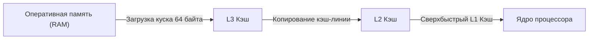

# Глава 2. Иерархия памяти: Кэш-линии, задержки и враги производительности

Процессор невероятно быстр, но он абсолютно бесполезен без памяти. Память хранит инструкции, текстуры, геометрию вокселей и статы персонажей. 

Главный парадокс компьютерного железа заключается в том, что процессоры за последние 40 лет стали работать быстрее в тысячи раз, а скорость доступа к оперативной памяти (RAM) увеличилась всего на порядок. 

В этой главе мы изучим многоуровневую систему памяти и поймем, как писать код, который «дружит» с кэшем процессора.

---

## 1. Пирамида Скоростей

Представь, что процессор — это шеф-повар на кухне. Скорость его работы зависит от того, как близко лежат ингредиенты (данные):

| Уровень памяти | Где находится | Время доступа (такты) | Аналогия с временем человека |
|---|---|---|---|
| **Регистры** | Прямо в АЛУ | **0 тактов** | Ингредиент уже в руке |
| **L1 Кэш** | На ядре (32-64 КБ) | **~4 такта** | Взять специю со стола перед собой |
| **L2 Кэш** | На ядре (512 КБ - 1 МБ) | **~12 тактов** | Протянуть руку к полке над столом |
| **L3 Кэш** | Общий на кристалле (16-96 МБ) | **~40 тактов** | Сходить в холодильник в конце кухни |
| **Оперативная память (RAM)**| Отдельные планки памяти | **~200-400 тактов** | Выйти из ресторана и съездить на склад на такси |
| **SSD накопитель (PCIe)** | На материнской плате | **~10 000+ тактов** | Полететь на самолете на ферму в другую страну |

Если процессору на каждый шаг физических расчетов чанка Zenith придется делать запрос в оперативную память (RAM), он будет **простаивать 99% времени**. Это называется **Memory Wall** (стена памяти).

---

## 2. Кэш-линии (Cache Lines)

Чтобы снизить число запросов к медленной RAM, процессор никогда не считывает из нее данные поштучно (например, по 4 байта float). Он всегда считывает данные блоками по **64 байта**. Эти блоки называются **Кэш-линиями (Cache Lines)**.

Если ты создаешь массив:
```java
int[] array = new int[16]; // Занимает ровно 64 байта
```
При первом обращении к `array[0]` процессор лезет в медленную RAM, считывает оттуда всю кэш-линию целиком (все 16 элементов `int` за раз) и кладет её в сверхбыстрый L1 кэш. 

Когда на следующем шаге цикла ты попросишь `array[1]`, `array[2]` и т.д. — они уже будут лежать в L1 кэше. Доступ займет не 300 тактов, а всего 4! Это называется **локальностью данных** (Spatial Locality).



---

## 3. Враг №1: Указатели и Cache Misses в Java

Java — прекрасный язык, но её стандартная объектная модель крайне враждебна к кэшу процессора. 

В Java массив примитивов `int[]` лежит в памяти непрерывным плоским блоком (100% Cache Friendly). А вот массив объектов `Integer[]` или `Point[]` — это **кошмар для кэша**:

* Массив ссылок `Point[]` хранит только 64-битные указатели. 
* Сами объекты `Point` лежат в куче (Heap) в абсолютно случайных разрозненных местах.

При итерации по `Point[]`:
1. Процессор считывает кэш-линию с указателями.
2. Пытается прочитать `points[0]`. Переходит по ссылке в случайный адрес памяти RAM → **Cache Miss!** (Ждем 300 тактов).
3. Переходит к `points[1]`. Снова прыгаем по ссылке в другой случайный адрес RAM → **Снова Cache Miss!** (Ждем еще 300 тактов).

В результате производительность падает в десятки раз просто из-за того, что ядра процессора бесконечно ждут данные из RAM.

> [!IMPORTANT]
> **Как это решено в Zenith**:
> Мы полностью ушли от массивов объектов при рендеринге чанков. Все координаты вершин блоков сжимаются (Vertex Compression) в плоские примитивные массивы `int[]`, которые считываются процессором последовательно на максимальной скорости.

---

## 4. Враг №2: Ложное разделение (False Sharing)

В многопоточном программировании (особенно при асинхронной генерации чанков на разных ядрах) возникает аппаратная ловушка: **False Sharing**.

Кэши L1 и L2 привязаны к конкретным ядрам процессора. Если Ядро 1 меняет переменную `stateX` (лежащую в кэш-линии А), а Ядро 2 меняет переменную `stateY` (лежащую на той же кэш-линии А):
* Ядро 1 меняет свои 4 байта. Аппаратный протокол когерентности кэшей видит это и помечает всю кэш-линию А в кэше Ядра 2 как недействительную (Invalid).
* Ядро 2 вынуждено заново загружать кэш-линию А из общей L3 памяти.
* Затем Ядро 2 меняет переменную `stateY`, инвалидируя кэш Ядра 1.

Ядра процессора вступают в бесконечную борьбу за перезапись одной и той же кэш-линии, хотя логически потоки абсолютно независимы!

> [!TIP]
> **Решение**: Выравнивай важные разделяемые переменные потоков на границу 64 байт (в Java 8+ для этого используется аннотация `@Contended` или ручные отступы в массивах).

В следующей главе мы разберем «Шоссе PCIe» — шину данных, которая связывает процессор с видеокартой, и узнаем, почему копирование геометрии чанков на видеокарту — это сложнейшая инженерная задача.
