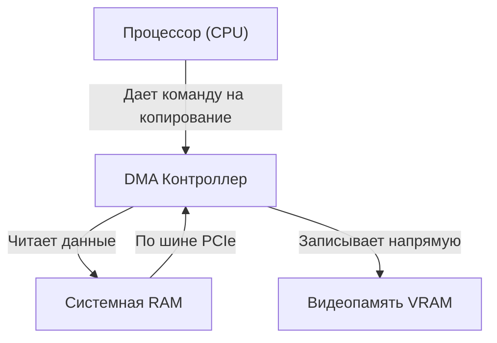

# Глава 3. Шоссе PCIe и DMA: Бутылочное горлышко между CPU и GPU

Когда мы пишем графическое приложение или 3D-игру, мы управляем двумя мощными процессорами одновременно: центральным (CPU) и графическим (GPU). 

Проблема в том, что физически они находятся в разных частях материнской платы и имеют собственную изолированную память (RAM у процессора и VRAM у видеокарты).

В этой главе мы разберем, как устроена системная шина PCIe, что такое чипсет и почему бездумная отправка полигонов на видеокарту способна превратить мощный игровой ПК в слайд-шоу.

---

## 1. Системная шина и Чипсет

На материнской плате все компоненты соединены сетью проводящих дорожек — **системными шинами**:

* **Прямой тракт (Direct Lanes)**: Современные процессоры имеют выделенные высокоскоростные линии PCIe (обычно 16 или 20 линий), которые ведут напрямую от сокета CPU к первому слоту видеокарты (PCIe x16) и к быстрейшему M.2 NVMe SSD-накопителю. Это сделано для минимизации задержек.
* **Чипсет (Chipset / Южный Мост)**: Это отдельный чип на материнской плате, который выполняет роль хаба для более медленной периферии. К нему подключаются SATA-диски, USB-контроллеры, клавиатуры, мыши, сетевые и звуковые карты. Чипсет упаковывает их разрозненный трафик и передает его в CPU по одной выделенной шине (например, DMI).

---

## 2. Шина PCIe — соломинка для реки данных

Шина **PCIe (PCI Express)** передает данные последовательно по нескольким параллельным каналам (линиям, Lanes). Спецификация PCIe x16 означает, что разъем использует 16 линий данных.

Сравним пропускную способность:
* Внутренняя шина видеокарты RTX 4080 (общение GPU чипа с VRAM): **~716 ГБ/сек**.
* Пропускная способность шины PCIe 4.0 x16 (общение CPU с видеокартой): **~31.5 ГБ/сек**.

Понимаешь масштаб проблемы? Видеокарта способна перемалывать геометрию и текстуры со скоростью урагана, но мы вынуждены передавать новые чанки игры через тонкую шину PCIe, скорость которой в 20 раз ниже!

Если твой движок на каждый кадр будет отправлять миллионы вокселей с CPU на GPU заново (как это делал старый классический OpenGL 1.X через `glVertex3f`), шина PCIe моментально забьется, и FPS рухнет до нуля.

---

## 3. DMA (Direct Memory Access) и копирование буферов

Чтобы не загружать CPU тупой работой по копированию гигабайт текстур и геометрии, архитектура ПК использует **DMA (прямой доступ к памяти)**:

1. **Без DMA (кошмар)**: Процессор вынужден считывать каждые 4 байта данных вершин из RAM в свои регистры, а затем записывать их в порты ввода-вывода видеокарты. На это время ядро CPU полностью заблокировано.
2. **С DMA (современный подход)**: Процессор дает команду специальному аппаратному DMA-контроллеру: *«Вот адрес вершин чанка в системной RAM, а вот адрес буфера в видеопамяти VRAM. Скопируй 2 мегабайта»*. Процессор моментально переключается на расчет игровой логики, а DMA-контроллер пересылает байты по шине PCIe в фоновом режиме. По завершении копирования видеокарта кидает прерывание, сообщая движку: *«Геометрия загружена, готова к отрисовке»*.

---

## 4. Как Zenith побеждает PCIe горлышко

Чтобы шина PCIe не забивалась, в архитектуре Zenith применены два фундаментальных принципа:

1. **Static Geometry Buffers (Загрузил и забыл)**: Геометрия чанков собирается на фоновых потоках процессора, загружается в VRAM видеокарты один раз через DMA и остается там навсегда (в Mesh Pool). При отрисовке кадров мы вообще не шлем геометрию по шине PCIe.
2. **MultiDraw Indirect (MDI)**: Вместо сотен тысяч вызовов отрисовки (которые нагружают драйвер и шлют кучу команд по PCIe), мы создаем один плоский буфер команд отрисовки (Indirect Buffer) прямо в VRAM. Процессор один раз дает команду `glMultiDrawElementsIndirect`, и видеокарта сама считывает все команды отрисовки локально из своей сверхбыстрой VRAM, разгружая шину PCIe на 99%.

В следующей главе мы разберем последний кирпич низкоуровневой платформы — операционную систему, процессы, потоки и виртуальную память.
