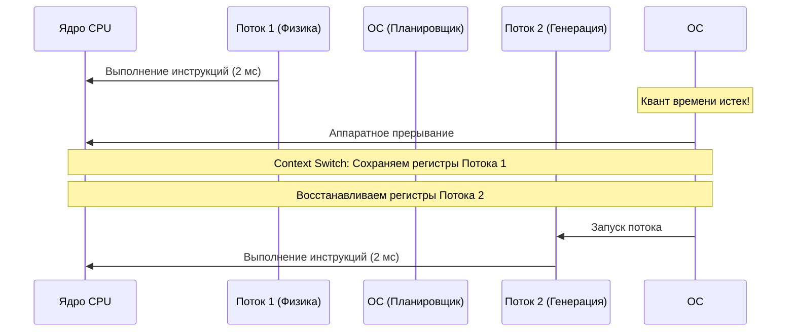

# Глава 4. Операционная система: Виртуальная память, процессы и цена потоков

Над физическим кремнием, транзисторами и контроллерами PCIe стоит главный программный дирижер — Операционная Система (Windows, Linux, macOS). Она распределяет физическое процессорное время между сотнями запущенных программ и следит, чтобы они не мешали друг другу.

В этой финальной главе курса по железу мы разберем, как ОС абстрагирует физическую оперативную память с помощью виртуальных страниц и почему создание «тысячи потоков» способно полностью парализовать работу самого мощного многоядерного процессора.

---

## 1. Процессы vs Потоки

С точки зрения операционной системы:

* **Процесс (Process)** — это изолированное государство. У него есть собственный выделенный кусок памяти (виртуальное адресное пространство), дескрипторы файлов, сетевые сокеты и права доступа. Процесс А физически не может прочитать память Процесса Б. Запуск игры Zenith — это создание отдельного процесса в ОС.
* **Поток (Thread)** — это рабочий внутри государства. В рамках одного процесса может быть запущено множество потоков. Все они разделяют одну и ту же память процесса (кучу - Heap), но у каждого потока есть свой собственный стек вызовов (Stack) и копия регистров процессора на ядре, где он выполняется. Фоновая генерация чанков в Zenith работает в отдельных потоках внутри одного процесса игры.

---

## 2. Виртуальная память и ошибки страниц (Page Faults)

Компьютер имеет, к примеру, 16 ГБ физической оперативной памяти (RAM). Но если ты посмотришь адреса переменных в своей программе, ты увидишь красивые упорядоченные числа от 0 до терабайт. Это магия **Виртуальной Памяти**.

ОС делит всю физическую RAM на блоки по **4 КБ** — они называются **Страницами (Pages)**.

Когда программа запрашивает память (например, выделяет буфер под геометрию мира):
1. Операционная система не выделяет её физически в RAM сразу. Она просто резервирует виртуальные адреса в **Таблице страниц (Page Table)** процесса.
2. Когда программа впервые пытается сделать запись в этот буфер, аппаратный блок процессора **MMU (Memory Management Unit)** видит, что виртуальный адрес не привязан к реальной RAM, и генерирует аппаратное прерывание — **Page Fault (Ошибка страницы)**.
3. ОС перехватывает управление, экстренно находит свободный кадр (Frame) в реальной физической RAM, связывает его с виртуальным адресом в таблице страниц и возобновляет работу программы. Для программы этот процесс абсолютно незаметен.

> [!CAUTION]
> **Ловушка файла подкачки (Swap)**:
> Если физическая RAM заканчивается, ОС начинает выгружать неактивные страницы памяти программ на жесткий диск (в swap-файл). Если твой 3D-движок попытается обратиться к странице, выгруженной в swap, произойдет Page Fault, и поток зависнет на миллионы тактов, пока медленный SSD считывает страницу обратно в RAM. Это порождает жесткие фризы (лаги) в играх.

---

## 3. Context Switch: Цена иллюзии многозадачности

У твоего процессора может быть 8 физических ядер. Но в диспетчере задач запущено 3000 потоков одновременно. Как ОС создает иллюзию, что все они работают одновременно? 

С помощью **Планировщика потоков (Scheduler)**. Он выделяет каждому потоку микроскопический квант времени (например, 2-5 миллисекунд). По истечению этого времени ОС принудительно прерывает поток и запускает следующий. Это называется **Переключением контекста (Context Switch)**.

### Почему Context Switch — это больно:
1. **Прямые расходы**: ОС тратит драгоценные такты процессора на сохранение и восстановление десятков регистров ядра, перенастройку MMU и таблиц страниц.
2. **Косвенные расходы (Самый сильный удар!)**: Переключение контекста полностью очищает кэши процессора (L1, L2, L3) и буфер ассоциативной трансляции (TLB). Новый поток начинает работу с «холодным» кэшем, упираясь в лавину Cache Misses при первом обращении к памяти.

> [!IMPORTANT]
> **Золотое правило многопоточности движков**:
> Никогда не создавай новые потоки (`new Thread()`) на каждую фоновую задачу. Накладные расходы на их создание и переключение уничтожат производительность. Используй фиксированный пул потоков (**ThreadPool** / **ForkJoinPool**), размер которого строго равен числу физических ядер процессора. В Zenith генерация чанков выполняется строго на пуле потоков с CAS-очередями, гарантируя нулевые накладные расходы.

---

Поздравляем! Ты полностью завершил изучение низкоуровневого устройства ПК. Теперь ты понимаешь, как транзисторы кремния объединяются в ядра, как кэши борются с задержками RAM, почему шина PCIe требует бережного отношения и как операционная система дирижирует потоками. 

Эти знания — твое абсолютное оружие. Теперь ты готов подняться выше и применить их при написании архитектуры воксельного движка Zenith!
