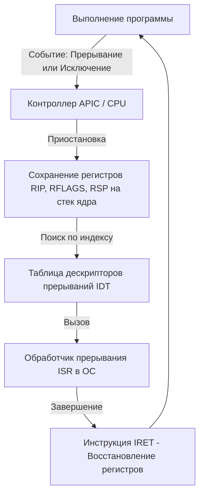

# Глава 4. Операционная система и потоки: Дирижер виртуального оркестра

Над физическим кремнием, транзисторами, глубокими конвейерами ядер CPU, многоуровневыми кэшами и скоростными шинами PCIe стоит главный программный правитель — **Операционная Система (Windows, Linux, macOS)**. Она выступает мостом абстракции, переводящим аппаратные возможности железа в удобный программный интерфейс для прикладного софта. 

Когда мы запускаем наш воксельный 3D-движок Zenith, мы не общаемся напрямую с регистрами прерываний или контроллерами памяти. За нас это делает ОС. 

В этой финальной главе курса по низкоуровневой архитектуре мы заглянем под капот операционной системы: детально разберем аппаратную логику прерываний, препарируем разницу между процессами и потоками на уровне регистров ядра, оценим колоссальную скрытую цену переключения контекста, изучим аппаратную физику синхронизации через префиксы `LOCK` и барьеры памяти, и поймем, как заставить операционную систему играть в одной команде с нашей игрой.

---

## 1. Аппаратные прерывания: Пульс управления

Компьютер не может работать в режиме постоянного синхронного ожидания событий (например, ждать, пока пользователь нажмет клавишу или пока сетевая карта примет пакет). Это сделало бы систему медленной. Вместо этого вся архитектура ПК построена на **событийно-управляемой модели** с использованием **прерываний (Interrupts)**.

Прерывание — это аппаратный или программный сигнал, который заставляет процессор мгновенно приостановить выполнение текущего кода, сохранить свое состояние и переключиться на специальную программу обслуживания.

Существует три типа таких событий:

1. **Аппаратные прерывания (Hardware Interrupts / IRQ)**:
   Генерируются физическими устройствами. Например, сетевая карта приняла пакет данных, или таймер материнской платы отсчитал квант времени. Сигнал поступает на специальный чип — **APIC (Advanced Programmable Interrupt Controller)**, который выстраивает прерывания по приоритетам и пробрасывает их на ядра CPU.
2. **Программные прерывания (Software Interrupts)**:
   Инициируются кодом самой программы с помощью специальных инструкций (например, `INT 0x80` в Linux или `SYSENTER`/`SYSCALL` в Windows). Именно так программы запрашивают услуги у операционной системы (делают **системные вызовы** — Syscalls): выделение памяти, запись в файл, вывод звука.
3. **Исключения (Exceptions / Traps)**:
   Возникают внутри самого процессора при попытке выполнить некорректную операцию: деление на ноль, обращение по нулевому указателю или аппаратная ошибка страницы памяти (**Page Fault**).



### Как CPU обрабатывает прерывание:
1. Завершается выполнение текущей микрооперации на конвейере.
2. Процессор автоматически сохраняет служебные регистры (`RIP`, `RFLAGS`, `RSP`, `CS`, `SS`) на специальный стек режима ядра (Kernel Stack).
3. Процессор обращается к **IDT (Interrupt Descriptor Table - Таблица дескрипторов прерываний)**. Это системный массив указателей, адрес которого хранится в специальном регистре процессора `IDTR`.
4. Используя номер прерывания как индекс, CPU находит адрес соответствующего **ISR (Interrupt Service Routine - Обработчик прерывания)** внутри ядра операционной системы и прыгает на него.
5. Обработчик ISR выполняет свою работу (например, считывает байты из порта клавиатуры).
6. Обработчик завершается специальной ассемблерной инструкцией `IRET` (Interrupt Return). Процессор восстанавливает сохраненные регистры из стека и бесшовно продолжает выполнение программы с того же места, где её прервали.

---

## 2. Процессы против Потоков: Анатомия на уровне ядра

Многие программисты знают стандартную мантру: «процесс изолирован, а потоки разделяют память». Давай посмотрим, как это выглядит на физическом уровне процессора.

### Процесс: Абсолютная изоляция

Процесс — это тяжеловесный контейнер ресурсов, созданный операционной системой. Он содержит:
* Виртуальное адресное пространство (память).
* Таблицы открытых дескрипторов файлов и сокетов.
* Права доступа и токены безопасности.

Аппаратная изоляция процессов друг от друга базируется на **регистрах таблиц страниц MMU**. В архитектуре x86 для каждого процесса создается своя иерархия таблиц трансляции адресов. Адрес корневой таблицы страниц текущего процесса записывается в служебный регистр процессора **`CR3` (Control Register 3)**.

Когда операционная система переключает выполнение с Процесса A на Процесс B, она перезаписывает значение регистра `CR3` физическим адресом таблицы страниц Процесса B. 

В этот же момент вся виртуальная память Процесса A мгновенно растворяется в воздухе для процессора. Процесс B физически не может прочитать или испортить память Процесса A, так как MMU процессора теперь использует совершенно другие таблицы трансляции. Это гарантирует абсолютную стабильность и безопасность ОС.

### Поток: Легковесный исполнитель

Поток (Thread) — это минимальный юнит выполнения кода, планируемый операционной системой. В рамках одного процесса может быть запущено множество потоков.

Все потоки одного процесса разделяют его ресурсы, кучу (Heap), глобальные переменные и открытые файлы. Но у каждого потока есть свой личный микромир на уровне процессора:
1. **Собственный стек (Stack)**: Выделенная область памяти (обычно от 1 до 8 МБ) для хранения локальных переменных, аргументов функций и адресов возврата.
2. **Собственный контекст регистров**: Когда поток выполняется на ядре, он полностью владеет всеми физическими регистрами ядра (`RAX`, `RBX`, `RIP`, `RSP` и т.д.).

---

## 3. Скрытый убийца FPS: Накладные расходы Context Switch

Иллюзия того, что на 8-ядерном процессоре одновременно работают тысячи потоков, создается за счет **планировщика ОС** (Scheduler). Он нарезает процессорное время на микроскопические интервалы — **кванты** (обычно 2-15 миллисекунд). По истечении кванта ОС принудительно забирает ядро у одного потока и отдает его другому. Это действие называется **переключением контекста (Context Switch)**.

Переключение контекста — невероятно дорогая операция, которая бьет по производительности игры с двух сторон:

### Прямые накладные расходы (Direct Overhead)
Ядро ОС обязано выполнить кучу аппаратных операций:
1. Перейти в режим ядра (Ring 0).
2. Сохранить значения всех физических регистров текущего потока в специальную структуру памяти — **TCB (Thread Control Block)**.
3. Запустить алгоритм планировщика, чтобы выбрать следующий поток.
4. Загрузить значения регистров нового потока из его TCB в физические регистры ядра.
5. Перенастроить указатель стека `RSP` на стек нового потока.
6. Если новый поток принадлежит другому процессу — перезаписать регистр `CR3` для смены адресного пространства.

Эти шаги съедают от нескольких тысяч до десятков тысяч тактов процессора на каждое переключение.

### Косвенные накладные расходы (Indirect Overhead - Настоящая катастрофа!)
Косвенный удар гораздо болезненнее. 
При смене процесса (перезаписи `CR3`) происходит **полный сброс буфера ассоциативной трансляции TLB**. 
Но даже если потоки принадлежат одному процессу, новый поток работает со своим кодом и своими данными. Он мгновенно инвалидирует («остужает») кэши L1i, L1d и L2 процессора. 
Новый поток начинает свою работу с тотального **холодного старта**. Процессор захлебывается в лавине **Cache Misses** и **TLB Misses**, зависая на сотни тактов при каждом первом обращении к памяти.

```
                  [ ПОТОК 1 (Физика игры) ]
                    Кэши L1/L2 прогреты на 100%
                             │
            ───────── Квант времени истек ─────────
                             │
                             ▼
                 [ Смена контекста (ОС) ]  <-- Потеря 5 000 тактов на сохранение регистров
                             │
                             ▼
                 [ ПОТОК 2 (Браузер/Периферия) ]
                 Все кэши L1/L2 полностью выбиты данными Потока 2
                             │
            ───────── Квант времени истек ─────────
                             │
                             ▼
                 [ Смена контекста (ОС) ]  <-- Потеря 5 000 тактов
                             │
                             ▼
                  [ ПОТОК 1 (Физика игры) ]
             Кэши «холодные». Первая тысяча операций 
             упирается в RAM (Cache Misses). Потеря еще 50 000 тактов!
```

> [!IMPORTANT]
> **Золотое правило многопоточности игр**:
> 1. **ThreadPool / ForkJoinPool**: Никогда не создавайте новые потоки на лету через `new Thread()`. Запуск и уничтожение потока — это колоссальные накладные расходы ОС. Используйте постоянный пул потоков, размер которого жестко равен количеству физических ядер процессора.
> 2. **Привязка потоков (Thread Affinity)**: Привязывайте критически важные потоки движка (например, поток рендеринга и поток расчета физики) к конкретным физическим ядрам процессора (`Thread.setAffinity` через нативные библиотеки). Это запретит операционной системе перекидывать ваш поток с одного ядра на другое (миграция потоков), сохраняя кэши L1/L2 идеально «горячими».

---

## 4. Аппаратная физика синхронизации: Атомарность и барьеры

Когда несколько потоков работают параллельно, нам необходимо синхронизировать их доступ к разделяемой памяти. Обычные операции вроде `x++` не являются атомарными на уровне ассемблера: они состоят из чтения значения в регистр, инкремента регистра и записи регистра обратно в память. Если в этот момент вмешается другой поток, данные будут испорчены (Race Condition).

Как синхронизация реализуется на физическом уровне процессора?

### Префикс LOCK в архитектуре x86

Для выполнения атомарных операций процессоры x86 поддерживают специальный префикс **`LOCK`** для ассемблерных команд (например, `LOCK XADD`, `LOCK CMPXCHG`).

Когда ядро видит инструкцию с префиксом `LOCK`:
1. На уровне кэшей срабатывает протокол когерентности. Кэш-линия, содержащая целевой адрес памяти, переводится в монопольное состояние **Exclusive (E)** или **Modified (M)**.
2. Процессор временно блокирует доступ к этой кэш-линии для всех остальных ядер на время выполнения текущей инструкции. Другие ядра физически не могут прочитать или записать данные по этому адресу, пока операция не завершится.
3. Инструкция выполняется атомарно, гарантируя целостность данных.

### Аппаратный Compare-And-Swap (CAS)

Фундаментом всех неблокирующих алгоритмов (Lock-Free) является операция **Compare-And-Swap (CAS)**. В процессорах x86 она реализована инструкцией **`CMPXCHG`** (Compare and Exchange).

Логика CAS атомарна: она сравнивает значение в памяти с ожидаемым значением, и если они равны, записывает по этому адресу новое значение. Это позволяет обновлять переменные без использования тяжелых мьютексов. На этом принципе построены все конкурентные коллекции Java (например, `ConcurrentHashMap`, `AtomicInteger`).

### Барьеры памяти (Memory Barriers / Fences)

Современные процессоры с внеочередным выполнением (OoO) любят переставлять ассемблерные инструкции чтения и записи местами, чтобы загрузить конвейеры и избежать простоев. 

Для одного ядра это безопасно, так как оно отслеживает зависимости. Но в многопоточном программировании агрессивная перестановка инструкций процессором может сломать логику работы.

*Пример*: Поток 1 записывает данные в буфер, а затем выставляет флаг готовности `ready = true`. Поток 2 ждет флага `ready` и затем читает буфер. Если процессор переставит инструкции местами и сначала запишет `ready = true`, Поток 2 прочитает из буфера пустой мусор.

Чтобы запретить процессору переставлять инструкции чтения и записи через критические границы, используются **барьеры памяти (Memory Barriers / Fences)**:
* **LFENCE (Load Fence)**: Запрещает процессору переставлять операции чтения (Load) через барьер. Все чтения до барьера гарантированно завершатся до начала чтений после барьера.
* **SFENCE (Store Fence)**: Запрещает перестановку операций записи (Store).
* **MFENCE (Memory Fence)**: Полный барьер. Запрещает перестановку любых операций чтения и записи в обе стороны.

В Java барьеры памяти неявно расставляются компилятором и JVM при использовании ключевого слова **`volatile`** или внутри блоков `synchronized`.

---

## 5. Мьютексы против Спин-локов: Битва за такты

При написании синхронизации у нас есть два принципиально разных подхода:

```
  ┌────────────────────────────────────────────────────────┐
  │ Попытка захвата блокировки                             │
  └───────────────────────────┬────────────────────────────┘
                              ▼
                       Занято? ── No ──> [ Захватываем ресурс ]
                              │
                             Yes
                              │
            ┌─────────────────┴─────────────────┐
            ▼                                   ▼
    [ МЬЮТЕКС (Mutex) ]                 [ СПИН-ЛОК (Spinlock) ]
    - Поток засыпает (ОС)               - Активное ожидание
    - Дорогой Context Switch            - Бесконечный цикл while(CAS)
    - Процессор свободен для            - Сжигает 100% ядра CPU
      других программ                   - Мгновенная реакция (<1 нс)
```

1. **Мьютекс (Mutex / Монитор)**:
   Если ресурс занят, поток добровольно отдает управление операционной системе. ОС переводит поток в состояние сна (Blocked) и убирает его с физического ядра процессора, запуская на нем другие задачи.
   * *Плюс*: Не расходует процессорные такты во время ожидания.
   * *Минус*: Огромные расходы на два переключения контекста (когда поток засыпает и когда просыпается).
2. **Спин-лок (Spinlock)**:
   Если ресурс занят, поток не засыпает. Он запускает бесконечный цикл, постоянно проверяя переменную блокировки через операцию CAS: `while(!tryLock());`.
   * *Плюс*: Мгновенное время реакции. Как только ресурс освобождается, поток продолжает работу в ту же наносекунду, без участия ОС и смены контекста.
   * *Минус*: Во время ожидания поток сжигает 100% процессорного времени одного ядра на бесполезную проверку в цикле, выделяя тонны тепла.

> [!TIP]
> **Правило выбора**:
> Используйте спин-локи только тогда, когда вы точно знаете, что критическая секция сверхкороткая (выполняется за несколько наносекунд, например, вставка элемента в очередь). Если же критическая секция может затянуться (чтение файла, сетевой запрос, сложная генерация), использование спин-лока убьет всю систему. Используйте классический мьютекс.

---

## 6. Великий финал: Симфония игрового движка

Поздравляем! Ты прошел монументальный путь от самого основания компьютерной архитектуры до вершин системного программирования. Давай на мгновение остановимся и посмотрим, как все изученные нами слои работают в единой, завораживающей симфонии в тот момент, когда ты запускаешь воксельный движок **Zenith**:

1. **Кремний и Транзисторы (Глава 0)**:
   Внутри кристаллов под действием электрического поля миллионы затворов транзисторов КМОП открывают и закрывают n-каналы, формируя логические вентили NAND/NOR. Сумматоры щелкают битами, складывая координаты вершин блоков.
2. **Анатомия CPU (Глава 1)**:
   Тактовый генератор задает частоту в 4 миллиарда тактов в секунду. Внеочередные суперскалярные конвейеры ядер перемалывают гигабайты микроопераций. Предсказатели переходов угадывают пути ветвления физики частиц, а векторные блоки SIMD (AVX) за один такт перемножают координаты 16 вокселей.
3. **Иерархия памяти (Глава 2)**:
   Чтобы АЛУ не задохнулись от ожидания данных из медленной DRAM, кэши L1-L3 на базе быстрой SRAM удерживают в себе самые горячие массивы чанков. Данные циркулируют блоками по 64 байта (кэш-линии). MMU через буфер TLB мгновенно переводит виртуальные адреса Java-объектов в физические координаты ячеек RAM.
4. **Шоссе PCIe и DMA (Глава 3)**:
   Когда фоновые потоки собрали геометрию нового чанка, CPU дает команду контроллеру DMA. Данные летят по скоростным дифференциальным линиям шины PCIe со скоростью десятков гигабайт в секунду напрямую в VRAM видеокарты, минуя ядра процессора. А технология Resizable BAR открывает процессору прямой доступ ко всей памяти видеокарты.
5. **Операционная Система и Потоки (Глава 4)**:
   Планировщик ОС нарезает кванты времени, удерживая баланс многозадачности. Потоки генерации чанков Zenith крутятся на фиксированном ThreadPool, исключая дорогие переключения контекста. Локальные кэши ядер остаются прогретыми благодаря привязке потоков (Thread Affinity), а потокобезопасные очереди общаются через атомарные инструкции CAS и барьеры памяти без блокировок.

Понимание этих низкоуровневых принципов — твое абсолютное супероружие. Ты больше не программируешь вслепую. Теперь ты видишь компьютер насквозь — как единый, слаженный кремниевый оркестр. Используй эти знания, чтобы писать самый быстрый, чистый и эффективный код для движка Zenith. Твой путь в настоящую системную архитектуру только начинается!
